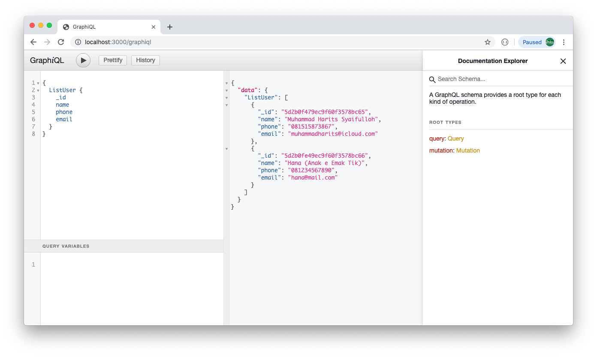

## Requirements:
- Node.js v8++
- MongoDB v3.4++

## Getting started:
- Clone this repo and change the directory to the cloned project
- Install dependencies by running `npm install`
- Create `.env` file that contains `MONGO_URI` variable
- Make sure your MongoDB server is running
- Run `npm start` to start the project
- Open `http://localhost:8000/graphiql` in browser

## Queries
Here are some example of queries
### ListUser
_Query:_
```javascript
{
  ListUser {
    _id
    name
    phone
    email
  }
}
```
_Reponse:_
```json
{
  "data": {
    "ListUser": [
      {
        "_id": "5d2b0f479ec9f60f3578bc65",
        "name": "Muhammad Harits Syaifulloh",
        "phone": "081515873888",
        "email": "muhammadharits@icloud.com"
      },
      {
        "_id": "5d2b0fe49ec9f60f3578bc66",
        "name": "John Doe",
        "phone": "081234567890",
        "email": "johndoe@mail.com"
      }
    ]
  }
}
```
### Detail User
_Query:_
```javascript
{
  DetailUser(id: "5d2b0f479ec9f60f3578bc65") {
    _id
    name
    phone
    email
  }
}
```
_Response:_
```json
{
  "data": {
    "DetailUser": {
      "_id": "5d2b0f479ec9f60f3578bc65",
      "name": "Muhammad Harits Syaifulloh",
      "phone": "081515873888",
      "email": "muhammadharits@icloud.com"
    }
  }
}
```
## Mutations
Here is example of mutation
### CreateUser
_Mutation:_
```javascript
mutation {
  CreateUser(data: {
    name: "Foo Bar"
    email: "foobar@mail.com"
    phone: "087736473642"
  })
}
```
_Response:_
```json
{
  "data": {
    "CreateUser": {
      "_id": "5d2b1ba68f6e1d10537cef12",
      "name": "Foo Bar",
      "phone": "087736473642",
      "email": "foobar@mail.com"
    }
  }
}
```